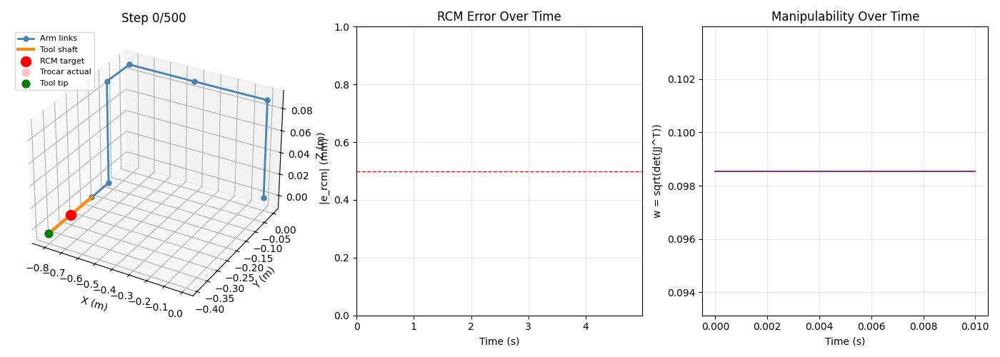
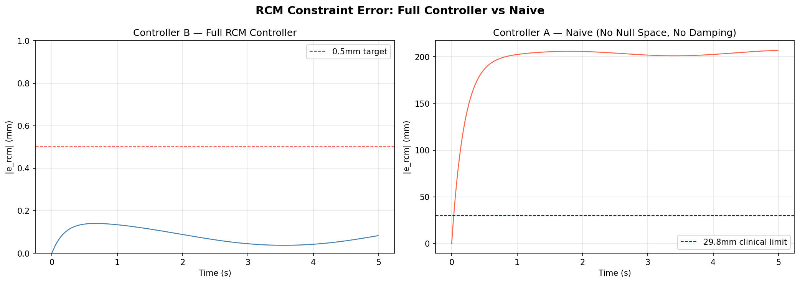
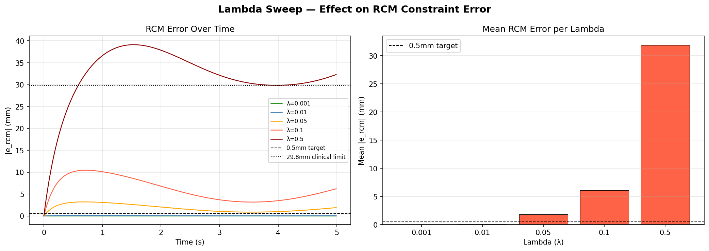

# rcm-control



A software-defined Remote Center of Motion (RCM) controller for laparoscopic 
surgical robotics, implemented in pure Python using a UR5 6-DOF manipulator.

The RCM constraint requires the surgical tool shaft to always pass through a 
fixed point in space — the trocar incision — regardless of where the tool tip 
moves. Violating this constraint tears patient tissue.

---

## Results

| Metric | Value |
|--------|-------|
| RCM error — mean | 0.0777 mm |
| RCM error — max | 0.5475 mm |
| Representative tolerance (literature) | 29.8 mm |
| Margin vs representative tolerance | **384x** |
| Naive controller (no null space) | 195.4 mm mean drift |



---

## Why this approach

A naive pseudoinverse controller directly tracking the tip position produces 
195.4mm of mean trocar drift — 6.5x beyond representative tolerances cited in 
surgical robotics literature. This controller enforces the RCM constraint as 
the primary task via null-space projection, relegating tip tracking to the 
remaining degrees of freedom. Damped least-squares singularity handling keeps 
joint velocities bounded across all configurations.

Three specific design choices matter:

- **Null-space projection** — tip tracking is mathematically guaranteed to never 
  disturb the trocar point
- **Damped least squares** — joint velocities stay bounded near singularities 
  where plain pseudoinverse fails
- **Periodic drift correction** — numerical integration error is caught and 
  corrected before accumulating beyond threshold

---

## Setup

```bash
pip install numpy matplotlib
python demo.py
```

---

## Parameter sweep

Lambda sweep across [0.001, 0.01, 0.05, 0.1, 0.5] confirms λ=0.01 as optimal —
accurate enough for sub-millimeter constraint satisfaction, conservative enough 
for bounded behavior near singularities.



---

## Technical note on tip tracking

Tip tracking error is large (~200mm) because the null space available after 
enforcing the RCM constraint has insufficient freedom to reach the commanded 
circular trajectory from the UR5 zero configuration. This is expected behavior — 
the controller correctly prioritizes constraint satisfaction over tip accuracy. 
In a real deployment the robot would be initialized closer to the target workspace.

---

## Math

Full derivations — DH parameters, geometric Jacobian, null-space controller, 
damped least squares, drift correction — in [docs/MATH.md](docs/MATH.md).

---

## Background

Coming from hydraulic excavator control on the MOOG-funded EARTH project — 
where constraint violations have immediate physical consequences — enforcing 
RCM algorithmically follows the same fundamental control logic.
